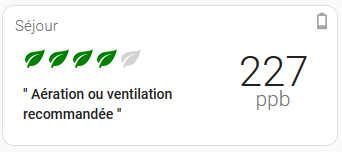
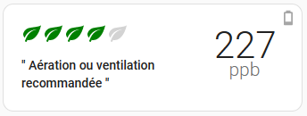

# SojjoAirQualityCard Card by [@Sojjocola](https://www.github.com/Sojjocola)

Home Assistant Lovelace custom cards for Air Quality Sensor like Aqara TVOC

[![GitHub Release][releases-shield]][releases]
[![License][license-shield]](LICENSE.md)

 

## Options

| Name              | Type    | Requirement  | Description                                      | Default             |
| ----------------- | ------- | ------------ | ------------------------------------------------ | ------------------- |
| type              | string  | **Required** | `custom:sojjoairquality-card`                    |                     |
| name              | string  | **Optional** | Card name                                        | `none`              |
| show_error        | boolean | **Optional** | Show what an error looks like for the card       | `false`             |
| show_warning      | boolean | **Optional** | Show what a warning looks like for the card      | `false`             |
| entity            | string  | **Required** | Home Assistant entity ID for your voc sensor     | `none`              |
| battery_entity    | string  | **Optional** | Home Assistant entity ID for your sensor battery | `none`              |
| tap_action        | object  | **Optional** | Action to take on tap                            | `action: more-info` |
| hold_action       | object  | **Optional** | Action to take on hold                           | `none`              |
| double_tap_action | object  | **Optional** | Action to take on double tap                     | `none`              |

## Action Options

| Name            | Type   | Requirement  | Description                                                                                                                            | Default     |
| --------------- | ------ | ------------ | -------------------------------------------------------------------------------------------------------------------------------------- | ----------- |
| action          | string | **Required** | Action to perform (more-info, toggle, call-service, navigate url, none)                                                                | `more-info` |
| navigation_path | string | **Optional** | Path to navigate to (e.g. /lovelace/0/) when action defined as navigate                                                                | `none`      |
| url             | string | **Optional** | URL to open on click when action is url. The URL will open in a new tab                                                                | `none`      |
| service         | string | **Optional** | Service to call (e.g. media_player.media_play_pause) when action defined as call-service                                               | `none`      |
| service_data    | object | **Optional** | Service data to include (e.g. entity_id: media_player.bedroom) when action defined as call-service                                     | `none`      |
| haptic          | string | **Optional** | Haptic feedback _success, warning, failure, light, medium, heavy, selection_ | `none`      |
| repeat          | number | **Optional** | How often to repeat the `hold_action` in milliseconds.                                                                                 | `none`       |

## Configuration example

```yaml
type: custom:sojjoairquality-card
entity: sensor.0x54ef458000685178_voc
battery_entity: sensor.0x54ef458000685178_battery
name: Séjour
```

## 
[license-shield]: https://img.shields.io/github/license/sojjo-airquality-card/sojjo-airquality-card.svg?style=for-the-badge
[releases-shield]: https://img.shields.io/github/release/sojjo-airquality-card/sojjo-airquality-card.svg?style=for-the-badge
[releases]: https://github.com/Sojjocola/sojjo-airquality-card/releases
